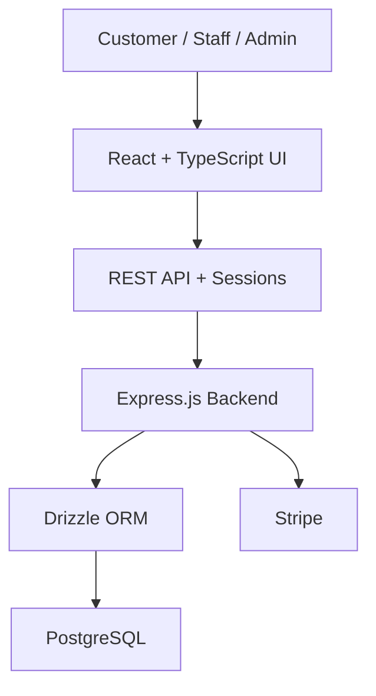

# Chicken Hat — Restaurant Management System


**Arabic-first full-stack ordering and restaurant operations platform.**

[Runtime](package.json) · [Database Config](drizzle.config.ts) · [Source Archive](ChickenHatPlatform_705.zip)

Arabic-first **full-stack restaurant ordering and management system** for a fried-chicken business. The project combines a customer storefront with operational tools for orders, menu items, reservations, users, and payments.

## Portfolio Proof

| Area | Evidence |
|---|---|
| **Problem** | Bring customer ordering, reservations, menu operations, users, and administration into one Arabic-first restaurant system. |
| **Solution** | React/TypeScript frontend with an Express backend, PostgreSQL/Drizzle data layer, sessions, role-based workflows, and payment integration support. |
| **Runtime stack** | [package.json](package.json) |
| **Database configuration** | [drizzle.config.ts](drizzle.config.ts) |
| **Source package** | [ChickenHatPlatform_705.zip](ChickenHatPlatform_705.zip) |
| **Current repository status** | The complete source is currently preserved as an archive while configuration files remain directly browsable. The next repository-cleanup step is to expand the source into normal GitHub folders without losing history. |


## Highlights

- Arabic RTL customer experience.
- Menu browsing, cart, checkout, and guest ordering.
- Table reservation workflow.
- Admin dashboard for menu, orders, and reservations.
- Role-based accounts for customers, staff, and administrators.
- Session-based authentication and password hashing.
- PostgreSQL data layer with Drizzle ORM.
- Stripe integration support for online payments.
- Responsive UI built with reusable Radix / shadcn components.

## Tech Stack

**Frontend:** React 18, TypeScript, Vite, Tailwind CSS, Radix UI, shadcn/ui, Wouter, TanStack Query, Zustand, React Hook Form, Zod.

**Backend:** Node.js, Express.js, TypeScript, PostgreSQL, Drizzle ORM, Express Sessions.

**Other:** Stripe, bcrypt, Neon PostgreSQL, Lucide React.

## Architecture



The application separates client state from server state: Zustand handles persisted cart state, while TanStack Query manages API-backed data.

## Core Data Model

The system includes entities for:

- Users and roles
- Customer addresses
- Menu categories
- Menu items
- Orders and order items
- Reservations
- Payment and order status

## Local Development

```bash
npm install
npm run dev
```

Type-check the project with:

```bash
npm run check
```

Database schema changes can be pushed with:

```bash
npm run db:push
```

The project expects the required database and payment environment variables to be configured before running backend-dependent features.

## Purpose

This repository demonstrates building a real operational product rather than a static restaurant landing page: storefront UX, application state, authentication, database-backed workflows, administration, and payment integration are designed as one system.
