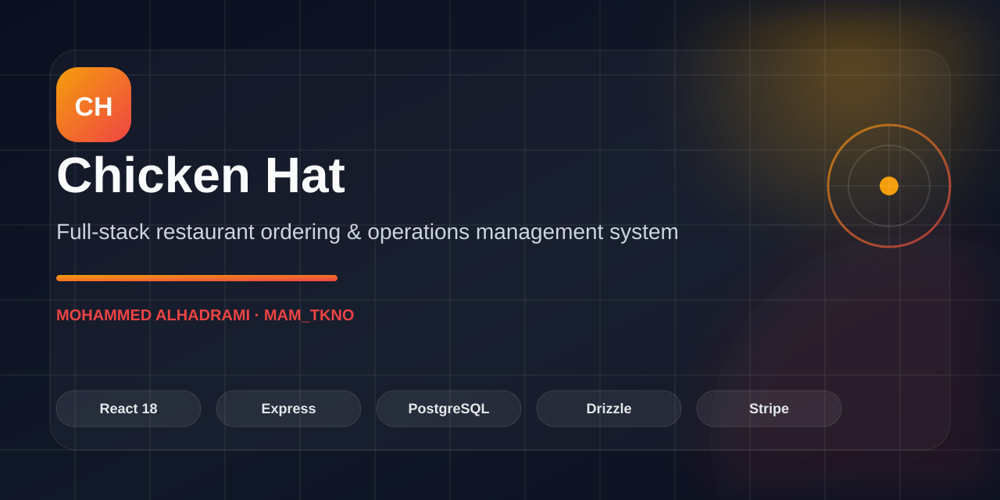
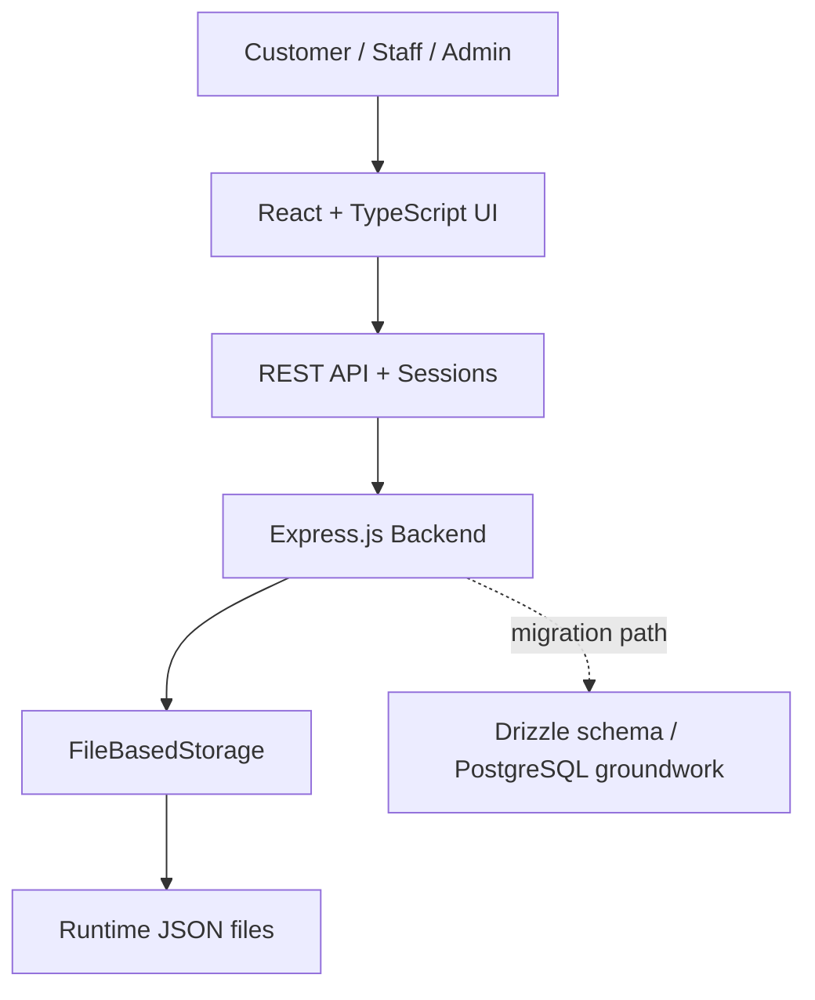

# Chicken Hat — Restaurant Management System




**Arabic-first full-stack ordering and restaurant operations platform.**

[Runtime](package.json) · [Frontend](client/) · [Backend](server/) · [Database Schema](shared/schema.ts)

Arabic-first **full-stack restaurant ordering and management system** for a fried-chicken business. The project combines a customer storefront with operational tools for orders, menu items, reservations, customer accounts, and protected administration.

## Portfolio Proof

| Area | Evidence |
|---|---|
| **Problem** | Bring customer ordering, reservations, menu operations, users, and administration into one Arabic-first restaurant system. |
| **Solution** | React/TypeScript frontend with an Express backend, customer sessions, protected admin APIs, and a file-backed persistence layer. A Drizzle/PostgreSQL schema is included as database-migration groundwork but is not the active runtime store. |
| **Runtime stack** | [package.json](package.json) |
| **Active persistence** | [server/file-storage.ts](server/file-storage.ts) |
| **Database migration groundwork** | [shared/schema.ts](shared/schema.ts) · [drizzle.config.ts](drizzle.config.ts) |
| **Frontend source** | [client/](client/) |
| **Backend source** | [server/](server/) |
| **Shared schema** | [shared/schema.ts](shared/schema.ts) |
| **Current repository status** | Source is directly browsable from the repository root; runtime order/customer data is excluded from version control. |


## Highlights

- Arabic RTL customer experience.
- Menu browsing, cart, checkout, and guest ordering.
- Table reservation workflow.
- Admin dashboard for menu, orders, and reservations.
- Customer accounts with HTTP-only sessions and a separate protected admin-access flow.
- Session-based authentication and password hashing.
- File-backed JSON persistence with atomic writes for the current implementation.
- Drizzle schema prepared for a future PostgreSQL-backed storage adapter.
- Order payment method/status fields are modeled; no live card-payment gateway is wired in this repository.
- Responsive UI built with reusable Radix / shadcn components.

## Tech Stack

**Frontend:** React 18, TypeScript, Vite, Tailwind CSS, Radix UI, shadcn/ui, Wouter, TanStack Query, Zustand, React Hook Form, Zod.

**Backend:** Node.js, Express.js, TypeScript, file-backed JSON persistence, Express Sessions, bcrypt.

**Data modeling:** Drizzle schema definitions are included for a future PostgreSQL adapter; they are not the active persistence implementation.

**Other:** Zod validation, Multer image uploads, Lucide React.

## Architecture



The application separates client state from server state: Zustand handles persisted cart state, while TanStack Query manages API-backed data.

## Core Data Model

The system includes entities for:

- Users and roles
- Customer addresses
- Menu categories
- Menu items
- Orders and order items
- Reservations
- Payment and order status

## Local Development

```bash
npm install
npm run dev
```

Type-check the project with:

```bash
npm run check
```

Create a local environment file before starting the server:

```bash
cp .env.example .env
```

Set strong values for `SESSION_SECRET` and `ADMIN_API_TOKEN`. Customer sessions fail closed without a valid session secret, and administrative APIs fail closed without a valid admin token.

The repository also contains Drizzle schema/configuration files for a future PostgreSQL storage adapter. Running `db:push` alone does **not** switch the application away from the current file-backed storage implementation.

## Purpose

This repository demonstrates building a real operational product rather than a static restaurant landing page: storefront UX, application state, real customer authentication, protected administration, reservations, ordering, and persistent operational workflows are designed as one system.
